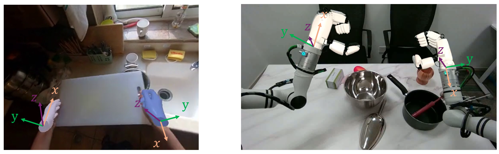

# VITRA Teleoperation Dataset

## Dataset Summary

This dataset contains real-world robot teleoperation demonstrations collected
using a 7-DoF robotic arm equipped with a dexterous hand and a head-mounted RGB
camera. Each episode provides synchronized **numerical state/action data**
and **video recordings**.

---

## Hardware Setup

- **Robot Arm**: Realman Arm (7-DoF)  
  URDF: https://github.com/RealManRobot/rm_models/tree/main/RM75/urdf/RM75-6F
- **Dexterous Hand**: XHand (12-DoF)
- **Head Camera**: Intel RealSense D455

---

## Data Modalities and Files

Each episode consists of two synchronized files:

- `<episode_id>.h5` — numerical data including robot states, actions, kinematics,
  and metadata
- `<episode_id>.mp4` — RGB video stream recorded from the head-mounted camera

The two files correspond **one-to-one** and share the same episode identifier.

---

## Coordinate Frames

The dataset uses the following coordinate frames:

- **arm_base**  
  Root frame of the arm kinematic chain, defined in the URDF.
- **ee_urdf**  
  End-effector frame defined in the URDF (joint7).
- **hand_mount**  
  Rigid mounting frame of the dexterous hand, including flange offset.  
  This frame is rotationally aligned with the human hand axis illustrated in Figure 1 (identity rotation).
- **head_camera**  
  Optical center of the head-mounted RGB camera.


<figure align="center">
  
  <figcaption><b>Figure 1.</b> The <code>hand_mount</code> frame axes. Axis directions follow the human hand definition illustrated in the figure.</figcaption>
</figure>


---

## Arm Availability and Masks

The dataset format is compatible with both **right-arm-only** episodes and **dual-arm** episodes. The currently released dataset contains only right-arm data.

- Missing arms/hands are filled with zeros to keep array shapes consistent.
- Availability is indicated by:
  - `/meta/has_left`, `/meta/has_right` (episode-level)
  - `/mask/*` (frame-level)

---

## HDF5 File Structure

Each `.h5` file follows the structure below:
```
/
├── meta/
│   ├── instruction                     string
│   ├── video_path                      string
│   ├── frame_count                     int # T
│   ├── fps                             float
│   ├── has_left                        bool
│   ├── has_right                       bool
│
├── kinematics/
│   ├── left_ee_urdf_to_hand_mount      (4, 4) float64
│   ├── right_ee_urdf_to_hand_mount     (4, 4) float64
│   ├── head_camera_to_left_arm_base    (4, 4) float64
│   └── head_camera_to_right_arm_base   (4, 4) float64
│
├── observation/
│   └── camera/
│       └── intrinsics                   (3, 3) float64
│
├── state/
│   ├── left_arm_joint                   (T, Na) float64  # joint positions (rad)
│   ├── right_arm_joint                  (T, Na) float64
│   ├── left_hand_mount_pose             (T, 6)  float64  # hand_mount pose in arm_base: [x,y,z,rx,ry,rz]
│   ├── right_hand_mount_pose            (T, 6)  float64  # hand_mount pose in arm_base: [x,y,z,rx,ry,rz]
|   ├── left_hand_mount_pose_in_cam      (T, 6)  float64  # hand_mount pose in head_camera: [x,y,z,rx,ry,rz]
|   ├── right_hand_mount_pose_in_cam     (T, 6)  float64  # hand_mount pose in head_camera: [x,y,z,rx,ry,rz]
│   ├── left_hand_joint                  (T, Nh) float64
│   └── right_hand_joint                 (T, Nh) float64
│
├── action/
│   ├── left_arm_joint                   (T, Na) float64  # target joint positions (rad)
│   ├── right_arm_joint                  (T, Na) float64  # target joint positions (rad)
│   ├── left_hand_joint                  (T, Nh) float64  # target joint positions (rad)
│   └── right_hand_joint                 (T, Nh) float64  # target joint positions (rad)
│
└── mask/
    ├── left_arm                         (T,) bool
    ├── right_arm                        (T,) bool
    ├── left_hand                        (T,) bool
    └── right_hand                       (T,) bool
```

---

## Pose Representation

For all `*_hand_mount_pose` entries, poses are represented as:

```
[x, y, z, rx, ry, rz]
```

where:
- `(x, y, z)` denotes the position of the `hand_mount` frame expressed in
  `arm_base` (meters)
- `(rx, ry, rz)` denotes the rotation vector in axis–angle representation
  (radians)

---

## Transformation Notation

A homogeneous transformation matrix is denoted by `T` (4×4).

- **Subscript**: reference frame (the coordinate system used for expression)
- **Superscript**: target frame (the frame being described)

All subscripts and superscripts are written on the **right-hand side** of `T`.

Example: $T^{hand\_mount}_{arm\_base}$ represents the pose of `hand_mount`
expressed in the `arm_base` frame.

---

## Kinematic Relations and Episode-Specific Transforms

Different flange hardware or camera mounting configurations may be used across
episodes or arms. As a result:

> **All kinematic and extrinsic transforms must be read from the current
> episode and must not be assumed constant.**

The hand mounting pose expressed in `arm_base` is computed as:

$$
T^{hand\_mount}_{arm\_base}
=
T^{ee\_urdf}_{arm\_base}
\cdot
T^{hand\_mount}_{ee\_urdf}
$$

where:

- $T^{ee\_urdf}_{arm\_base}$ is obtained via forward kinematics (FK) from the arm
  joint positions, corresponding to the URDF end-effector frame (joint7).
- $T^{hand\_mount}_{ee\_urdf}$ is a fixed, episode-specific transform provided under
  `/kinematics/*_ee_urdf_to_hand_mount`.

**Camera extrinsics may also vary across episodes.**  
Transforms under `/kinematics/head_camera_to_*_arm_base` should likewise be
read from the current episode and must not be assumed constant.
The hand mounting pose expressed in `head_camera` frame (i.e. `*_hand_mount_pose_in_cam`) is: 

$$
T^{hand\_mount}_{head\_camera} 
=
(T^{head\_camera}_{arm\_base})^{-1}
\cdot
T^{hand\_mount}_{arm\_base} 
$$

where:

- $T^{head\_camera}_{arm\_base}$ is episode-specific transform provided under  `/kinematics/head_camera_to_*_arm_base`

---