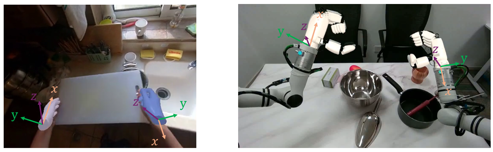

<div align="center">

<h1 align="center"><span
    style="font-family: 'Courier New', Courier, monospace; font-size: 115%;"><span style="font-size: 130%;">V</span>ITRA</span>:<br><span
    style="font-size:2.22rem;">Scalable Vision-Language-Action Model Pretraining <br> for Robotic Manipulation with Real-Life Human Activity Videos
    </span></h1>

<p align="center">
    <a href="https://arxiv.org/abs/2510.21571"></a>
    <a href='https://microsoft.github.io/VITRA/'></a>
    <a href='https://huggingface.co/VITRA-VLA/VITRA-VLA-3B'></a>
    <a href='https://huggingface.co/datasets/VITRA-VLA/VITRA-1M'></a>
    <a href='LICENSE'></a>
</p>

<p align="center"></p>

<div align="justify">
<span style="font-family: 'Courier New', Courier, monospace; font-size: 115%;"><span style="font-size: 130%;">V</span>ITRA</span> is a novel approach for pretraining Vision-Language-Action (VLA) models for robotic manipulation using large-scale, unscripted, real-world videos of human hand activities. Treating human hand as dexterous robot end-effector, we show that in-the-wild egocentric human videos without any annotations can be transformed into data formats fully aligned with existing robotic V-L-A training data in terms of task granularity and labels. We create a human hand V-L-A dataset containing over 1 million episodes. We further develop a VLA model with a causal action transformer trained on this dataset. It demonstrates strong zero-shot human-hand action prediction in entirely new scenes and serves as a cornerstone for few-shot finetuning and adaptation to real-world robotic manipulation.
<br>
<br>

***For video demonstrations, please refer to our [project page](https://microsoft.github.io/VITRA/).***
</div>

<br>

</div>

---

## 🚩 New & Updates
*   **[2025-11-30]** 🚀 Our code, pretrained models, and datasets are now open-sourced.
*   **[2025-10-24]** 🚀 **VITRA** paper is released on arXiv.

---

## 📑 Table of Contents
- [1. Installation](#1-installation)
- [2. Inference with Human Hand Image](#2-inference-with-human-hand-image)
- [3. Fine-tuning with a Custom Robot Dataset](#3-fine-tuning-with-a-custom-robot-dataset)
  - [3.1 Data Preparation](#31-data-preparation)
  - [3.2 Implementing a Custom RoboDatasetCore](#32-implementing-a-custom-robodatasetcore)
  - [3.3 Computing Dataset Statistics](#33-computing-dataset-statistics)
  - [3.4 Modify Configuration](#34-modify-configuration)
  - [3.5 Run Scripts](#35-run-scripts)
- [4. Deployment in the Real World](#4-deployment-in-the-real-world)
- [5. Human Hand VLA Dataset Utilization](#5-human-hand-vla-dataset-utilization)
- [6. Human Data Pretraining from Scratch](#6-human-data-pretraining-from-scratch)
  - [6.1 Dataset Preparation](#61-dataset-preparation)
  - [6.2 Compute Dataset Statistics](#62-compute-dataset-statistics)
  - [6.3 Modify Configuration](#63-modify-configuration)
  - [6.4 Run Scripts](#64-run-scripts)
- [Citation](#citation)


---

## 1. Installation

We recommend using `conda` to manage the environment. We require PyTorch >= 2.3.0 and CUDA >= 12.1 (It may run with lower versions, but we have not tested it).

```bash
# Clone the repository
git clone https://github.com/microsoft/VITRA.git
cd VITRA

# Create environment
conda create -n vitra python=3.10 -y
conda activate vitra

# Install dependencies
pip install -e .
```

If you want to run **dataset visualization** or **visualize** the results after inference, please refer to the **Prerequisites** section in [`data/data.md`](data/data.md) and install the additional required dependencies.

<details>
<summary>Click to view detailed system requirements</summary>

*   **OS**: Linux (Ubuntu 20.04/22.04 recommended)
*   **Python**: 3.10+
*   **CUDA**: 11.8+
*   **GPU**: Minimum 16GB VRAM for inference, A100/H100 recommended for training.
</details>

---

## 2. Inference with Human Hand Image

You can use our pretrained model to predict actions (the 6D wrist motion and MANO pose of hands) directly from **egocentric human hand images**.

To predict human actions from pre-captured images, camera FOV, and hand state, and to render the results as a video, please refer to the `scripts/inference_human.py` file. Here is an example:

```bash
python scripts/inference_human.py \
    --config VITRA-VLA-3B/configs/config.json \
    --image_path ./examples/hand_prediction/image_1.jpg \
    --hand_path ./examples/hand_prediction/state_1.npy \
    --use_left \
    --video_path ./example_human_inf.mp4 \
    --model_path /VITRA-VLA-3B/checkpoints/vitra-vla-3b.pt \
    --statistics_path VITRA-VLA-3B/statistics/dataset_statistics.json \
    --mano_model_path ./weight/mano \
    --instruction "Left: Put the trash into the garbage. Right: None."
```


This example assumes that both **`hand_state`** and **camera `fov_x`** are stored in the **Hand State File**.

This example assumes a camera setup where **`fx ≈ fy`**. In this workflow, **`hand_state`** is obtained from **HaWoR**, which estimates hand pose from a **single RGB image**.

> **Note:**  
> For higher-quality inference results, capture images with the camera positioned close to **human eye height**, aligning with natural egocentric viewpoints.  
> Extremely unusual or distorted hand poses/positions in the image may lead to inference failure.

**Hand State File Format**

The hand state is stored as a `.npy` file containing a Python dictionary with the following structure:

- **Format:** `.npy`
- **Content:** dictionary with MANO-based hand pose parameters and camera FOV.
- **Structure:**
    ```python
    {
        'left': {
            0: {
                'hand_pose': np.ndarray,      # [15, 3, 3] rotation matrices for MANO joints
                'global_orient': np.ndarray,  # [3, 3] global rotation matrix
                'transl': np.ndarray,         # [3] root translation in camera coordinates
                'beta': np.ndarray            # [10] MANO shape parameters
            }
        },
        'right': {                           # Same structure as 'left'
            0: {
                ...
            }
        },
        'fov_x': float                       # Horizontal field of view (in degrees)
    }
    ```

<!-- TODO: Estimating FOV and hand state from a single image -->
Below is the **minimum usage** for predicting human actions. 


```python
import json
import torch
import numpy as np
from PIL import Image
from vitra.models import VITRA_Paligemma, load_model
from vitra.utils.data_utils import resize_short_side_to_target
from vitra.datasets.human_dataset import pad_state_human, pad_action
from vitra.utils.data_utils import load_normalizer
from vitra.datasets.dataset_utils import (
    ActionFeature,
    StateFeature,
)

# Load configs
configs = json.load(open('configs/config.json'))
pretrained_path = 'checkpoints/vitra-vla-3b.pt'
statistics_path = 'statistics/dataset_statistics.json'
configs['model_load_path'] = pretrained_path
configs['statistics_path'] = statistics_path

# Load model and normalizer
model = load_model(configs).cuda()
model.eval()

normalizer = load_normalizer(configs)

image_path = "your_image.jpg"
image = Image.open(image_path)
image = resize_short_side_to_target(image, target=224)
fov = torch.tensor([[np.deg2rad(60.0), np.deg2rad(60.0)]])      # input your camera FOV here [fov_x, fov_y]

image = np.array(image)

# Input your prompt here. Only predict the right hand action as an example.
instruction = "Left hand: None. Right hand: Pick up the phone on the table."  

# Initialize state
# State vector structure (total dimension: 122):
#   - state_left [51]:      Left hand state vector
#       * [0:3]    transl:          Translation in camera space (x, y, z in meters)
#       * [3:6]    global_orient:   Global rotation as Euler angles (xyz, in radians)
#       * [6:51]   hand_pose:       45 joint angles as Euler angles (15 joints × 3 axes, in radians)
#   - beta_left [10]:       Left hand MANO shape parameters
#   - state_right [51]:     Right hand state vector (same structure as state_left)
#       * [0:3]    transl:          Translation in camera space (x, y, z in meters)
#       * [3:6]    global_orient:   Global rotation as Euler angles (xyz, in radians)
#       * [6:51]   hand_pose:       45 joint angles as Euler angles (15 joints × 3 axes, in radians)
#   - beta_right [10]:      Right hand MANO shape parameters
state = np.zeros((normalizer.state_mean.shape[0],))             # Input your hand state here
# Only use right hand state as an example.
# state_mask[0] indicates whether to use left hand state, 
# state_mask[1] indicates whether to use right hand state.
state_mask = np.array([False, True], dtype=bool)                # Input your hand state mask here. 


# Input your action_mask here. Shape: (W, 2) where W is chunk_size. 
# action_mask[:, 0] indicates whether to predict left hand actions, 
# action_mask[:, 1] indicates whether to predict right hand actions. 
# All left hand False, all right hand True as an example.
action_mask = np.tile(np.array([[False, True]], dtype=bool), (model.chunk_size, 1))  


# Normalize state
norm_state = normalizer.normalize_state(state)

unified_action_dim = ActionFeature.ALL_FEATURES[1]   # 192
unified_state_dim = StateFeature.ALL_FEATURES[1]     # 212

unified_state, unified_state_mask = pad_state_human(
    state = norm_state,
    state_mask = state_mask,
    action_dim = normalizer.action_mean.shape[0],
    state_dim = normalizer.state_mean.shape[0],
    unified_state_dim = unified_state_dim,
)
_, unified_action_mask = pad_action(
    actions=None,
    action_mask=action_mask,
    action_dim=normalizer.action_mean.shape[0],
    unified_action_dim=unified_action_dim
)

# Model inference
norm_action = model.predict_action(
    image = image,
    instruction = instruction,
    current_state = unified_state.unsqueeze(0),
    current_state_mask = unified_state_mask.unsqueeze(0),
    action_mask_torch = unified_action_mask.unsqueeze(0),
    num_ddim_steps = 10,
    cfg_scale = 5.0,
    fov = fov,
    sample_times = 1
)
norm_action = norm_action[0, :,:102]
# Denormalize predicted action
unnorm_action = normalizer.unnormalize_action(norm_action)
print("Predicted Action:", unnorm_action)
```

<!-- ### Interactive Demo
Launch a local Gradio demo to visualize the action predictions:
```bash
python scripts/demo.py --model_path vitra-org/vitra-3b-base
``` -->
**Note:** When using the vitra-paligemma2 model, please log in to your Hugging Face account and request access to the [Paligemma-2 model](https://huggingface.co/google/paligemma2-3b-mix-224).

---

## 3. Fine-tuning with a Custom Robot Dataset


VITRA models serve as starting points for robot-specific fine-tuning (e.g., on Xhand or your custom robot).

### 3.1 Data Preparation

We use the **camera-space end-effector (EEF) pose** to represent the wrist pose of the dexterous hand. The teleoperation **command sent to the XHand** is treated as the dexterous-hand **joint action**, and the retrieved **XHand joint angles** are used as the hand joint state. Before fine-tuning with robot data, we strongly recommend aligning both hands’ EEF **translation** and **rotation** coordinate frames to the coordinate system used in the Hand V-L-A dataset.  

Align all coordinates to the **camera coordinate system**:

- **X-axis**: pointing to the right of the screen (positive direction)  
- **Y-axis**: pointing downward on the screen (positive direction)  
- **Z-axis**: pointing away from the camera, perpendicular into the screen (positive direction)  

For the **EEF rotation origin**, pay attention to the mirror relationship between the left and right hands. After aligning the rotation origin, the EEF pose should match the case in the following image. The left side is an example of Human V-L-A dataset; The right side is an aligned example of XHand dataset. 



In addition, we provide the `transfer_xhand_to_human` function in [`vitra/dataset/robot_dataset.py`](./vitra/dataset/robot_dataset.py), which maps XHand joint angles to the closest degrees of freedom used in the human-hand representation. (Note that this XHand-to-human-hand alignment **does not need to be preprocessed offline**. It will be automatically applied during trajectory transformation inside the `transform_trajectory` function of the `RoboDatasetCore` class.)

If you are using a different dexterous hand model, we recommend implementing a similar function to align its joint configuration with the human-hand DoF.


### 3.2 Implementing a Custom `RoboDatasetCore`

To adapt the dataset loader to your own robot data, you should create a custom implementation of the `RoboDatasetCore` class in [`vitra/dataset/robot_dataset.py`](./vitra/dataset/robot_dataset.py).

The following methods typically need to be overridden to match the **human-data pretraining format**:

```python
def __len__(self):
    # return the number of frames
    ...

def __getitem__(self, idx):
    """
    Returns a sample dictionary
    """
    ...
    return {
        "instruction": instruction,
        "image_list": image_list,
        "image_mask": image_mask,
        "action_list": action_list,
        "action_mask": action_mask,
        "current_state": current_state,
        "current_state_mask": current_state_mask,
        "fov": fov,
        "intrinsics": self.intrinsics,
    }

def transform_trajectory(self, trajectory):
    # apply coordinate alignment, eef transformation,
    # xhand-to-human-hand joint mapping, etc.
    ...
    return {
        "instruction": instruction,
        "image_list": image_list,
        "image_mask": image_mask,
        "action_list": action_list,
        "action_mask": action_mask,
        "current_state": current_state,
        "current_state_mask": current_state_mask,
        "fov": fov,
        "intrinsics": self.intrinsics,
    }
```

The dictionary returned by `__getitem__` contains multiple fields representing the robot state, actions, and observations. Here, we use the **XHand** configuration as an example for illustration:

- **Left Hand**: 6-DoF EEF pose + 12 joint angles
- **Right Hand**: 6-DoF EEF pose + 12 joint angles  


| Key                    | Type                     | Shape                           | Description                                                                                                                          |
| ---------------------- | ------------------------ | ------------------------------- | ------------------------------------------------------------------------------------------------------------------------------------ |
| **instruction**        | `str`                    | —                               | Natural language description of the task. e.g., "Left hand: None. Right hand: {Right hand prompt}"                                                                               |
| **image_list**         | `np.ndarray, uint8`          | `(1, H, W, 3)`               | RGB images sequence. <br> - `T`: time steps <br> - `C=3`: channels <br> - `H,W`: height and width |
| **image_mask**         | `np.ndarray, bool`           | `(1,)`              | Indicates which frames are valid (1=valid, 0=padded)         
| **action_list**        | `np.ndarray, float32`           | `(T, 36)`                        | Sequence of robot actions.           |                                                                        |
| **action_mask**        | `np.ndarray, bool`           | `(T,)`                          | Indicates which actions are valid                                                                                                    |
| **current_state**      | `np.ndarray, float32`           | `(36,)`                          | Robot state at current time step.          |
| **current_state_mask** | `np.ndarray, float32`           | `(36,)`                          | Mask indicating valid state dimensions (1=valid, 0=masked)                                                                           |
| **fov**                | `np.ndarray, float32`           | `(2,)` | Camera FOV                                         |
| **intrinsics**         | `np.ndarray, float32` | `(3, 3)`                               | Camera intrinsic parameters, not used in training or model inference.                              |


### 3.3 Computing Dataset Statistics

Before training, we need to compute the **dataset statistics** for the robot dataset, specifically the mean and standard deviation of the **state** and **action** variables. These statistics will be used to **normalize the actions** using a Gaussian normalization.

### 3.4 Modify Configuration

After preparing the dataset and computing statistics, you can edit the `vitra/configs/robot_finetune.json` file to update paths and other relevant settings. `pretrain_path` should be replaced with the path to the pretrained model or the folder containing it, so that fine-tuning can be performed correctly.


In `scripts/run_robot_finetune.sh`, make sure to input your Hugging Face token and WANDB API key for proper authentication and logging.

### 3.5 Run Scripts

Once the configuration is ready, you can start pretraining by running:

```bash
bash scripts/run_robot_finetune.sh
```

<!-- TODO: Give an example code -->
---

## 4. Deployment in the Real World
Below is an example of running inference with **VITRA** on the XHand platform.

```python
import json
import torch
import numpy as np
from PIL import Image
from vitra.models import VITRA_Paligemma, load_model
from vitra.utils.data_utils import resize_short_side_to_target
from vitra.datasets.human_dataset import pad_state_human, pad_action
from vitra.utils.data_utils import load_normalizer
from vitra.datasets.dataset_utils import (
    ActionFeature,
    StateFeature,
)
from vitra.datasets.robot_dataset import (
    transfer_xhand_to_human,
    transfer_human_to_xhand,
    pad_state_robot, pad_action
)
# Load configs
configs = json.load(open('configs/robot_finetune.json'))
pretrained_path = 'checkpoints/finetuned_model.pt'
statistics_path = 'statistics/RoboData_statistics.json'
configs['model_load_path'] = pretrained_path
configs['statistics_path'] = statistics_path

# Load model and normalizer
model = load_model(configs).cuda()
model.eval()

normalizer = load_normalizer(configs)

image_path = "your_image.jpg"
image = Image.open(image_path)
image = resize_short_side_to_target(image, target=224)
fov = torch.tensor([[np.deg2rad(60.0), np.deg2rad(60.0)]])      # input your camera FOV here [fov_x, fov_y]

image = np.array(image)

# Input your prompt here. Only predict the right hand action as an example.
instruction = "Left hand: None. Right hand: Pour the contents of the bottle into the pot."  

# Initialize state
# State vector structure (total dimension: 36):
#   - Left hand [0:18]:
#       * [0:3]    transl:          Wrist translation in camera space (x, y, z in meters)
#       * [3:6]    global_orient:   Wrist rotation as Euler angles (xyz, in radians)
#       * [6:18]   hand_pose:       XHand joint angles (12 joints, in radians)
#   - Right hand [18:36]:
#       * [18:21]  transl:          Wrist translation in camera space (x, y, z in meters)
#       * [21:24]  global_orient:   Wrist rotation as Euler angles (xyz, in radians)
#       * [24:36]  hand_pose:       XHand joint angles (12 joints, in radians)
state = np.zeros((normalizer.state_mean.shape[0],))             # Input your hand state here
# Only use right hand state as an example.
# state_mask[0] indicates whether to use left hand state, 
# state_mask[1] indicates whether to use right hand state.
state_mask = np.array([False, True], dtype=bool)                # Input your hand state mask here. 


# Input your action_mask here. Shape: (W, 2) where W is chunk_size. 
# action_mask[:, 0] indicates whether to predict left hand actions, 
# action_mask[:, 1] indicates whether to predict right hand actions. 
# All left hand False, all right hand True as an example.
action_mask = np.tile(np.array([[False, True]], dtype=bool), (model.chunk_size, 1))  


# Normalize state
norm_state = normalizer.normalize_state(state)

unified_action_dim = ActionFeature.ALL_FEATURES[1]   # 192
unified_state_dim = StateFeature.ALL_FEATURES[1]     # 212

unified_state, unified_state_mask = pad_state_robot(
    state = norm_state,
    state_mask = state_mask,
    state_dim = normalizer.state_mean.shape[0],
    unified_state_dim = unified_state_dim,
)
_, unified_action_mask = pad_action(
    actions=None,
    action_mask=action_mask,
    action_dim=normalizer.action_mean.shape[0],
    unified_action_dim=unified_action_dim
)
human_state, human_state_mask, _, human_action_mask = transfer_xhand_to_human(
    unified_state, unified_state_mask,
    None, unified_action_mask
)
# Model inference
norm_action = model.predict_action(
    image = image,
    instruction = instruction,
    current_state = human_state.unsqueeze(0),
    current_state_mask = human_state_mask.unsqueeze(0),
    action_mask_torch = human_action_mask.unsqueeze(0),
    num_ddim_steps = 10,
    cfg_scale = 5.0,
    fov = fov,
    sample_times = 1
)
norm_action = norm_action[0, :,:102]
norm_robot_action = transfer_human_to_xhand(norm_action)
# Denormalize predicted action
unnorm_action = normalizer.unnormalize_action(norm_robot_action)
print("Predicted Action:", unnorm_action.shape)
# results in 2x 18-DoF actions of 16 steps with shape [16, 36]

```

---

## 5. Human Hand VLA Dataset Utilization


We release the **Human Hand V-L-A** dataset, which transforms "in-the-wild" videos into robot-aligned `(image, instruction, action)` tuples.  

You can download the dataset annotations from [VITRA-1M](https://huggingface.co/datasets/VITRA-VLA/VITRA-1M).
After downloading, please extract all `.gz` files using the following commands:
```bash
tar -xzvf ego4d_cooking_and_cleaning.tar.gz
tar -xzvf ego4d_other.tar.gz
tar -xzvf egoexo4d.tar.gz
tar -xzvf ssv2.tar.gz
tar -xzvf epic.tar.gz
```
For detailed information on the dataset, its structure, and usage instructions, please refer to the [`data/data.md`](data/data.md) file.


----


## 6. Human Data Pretraining from Scratch

To reproduce our pretraining results on the **Human-VLA** dataset:

### 6.1 Dataset Preparation

First, please follow the instructions in [`data/data.md`](data/data.md) to download the video dataset and the corresponding annotation files. After downloading, perform **[undistortion](data/data.md)** on the videos to correct for fisheye and lens distortions before further preprocessing.

#### Note on EgoExo4D Video Preprocessing

The undistorted EgoExo4D videos contain black borders due to fisheye correction. We apply an additional preprocessing step to remove these borders: first resize all EgoExo4D frames size to 448×448, then center-cropped to 256×256. The change of the intrinsics is already handled in `vitra/datasets/human_dataset.py`, where the computation of camera intrinsics incorporates the crop transformation and adjusts the camera FOV accordingly.


Once prepared, organize the data in the following directory structure:
```
Data_root/
├── Video/
│   ├── Ego4D_root/
│   │   ├── {video_name1}.mp4
│   │   ├── {video_name2}.mp4
│   │   └── ...
│   ├── Epic-Kitchen_root/
│   │   ├── {video_name1}.MP4
│   │   ├── {video_name2}.MP4
│   │   └── ...
│   ├── EgoExo4D_root/
│   │   ├── {video_name1}.mp4
│   │   ├── {video_name2}.mp4
│   │   └── ...
│   └── Somethingsomething-v2_root/
│       ├── {video_name1}.webm
│       ├── {video_name2}.webm
│       └── ...
└── Annotation/
    ├── ego4d_cooking_and_cleaning/
    ├── ego4d_other/
    ├── egoexo4d/
    ├── epic/
    ├── ssv2/
    └── statistics/
```

#### Notes:

- `Video/` contains all raw video files from different sources such as Ego4D, Epic-Kitchen, EgoExo4D, and Something-Something v2.  
- `Annotation/` contains the annotation files aligned with the corresponding videos.  

#### (Optional) Speed-Up Tips for Training

To further accelerate training, we recommend the following optional preprocessing steps:

1. Resize all processed videos to 224×224 for faster decoding and memory savings.  
2. Split long videos into shorter clips of at most 2000 frames each.  
   Name the clips using the format: `{video_name}_part{part_index}.mp4`, where `part_index` starts from **1**.
3. In `configs/human_pretrain.json`, set:
```json
"clip_len": 2000
```
This significantly improves data-loading speed during training, especially for large-scale datasets.

### 6.2 Compute Dataset Statistics

You can directly use the precomputed statistics provided in the downloaded dataset.
Alternatively, You can compute the dataset statistics (mean and standard deviation of states and actions) by running the following command.  

```bash
python vitra/datasets/calculate_statistics.py --save_folder data_root/statistics
```

### 6.3 Modify Configuration

Edit the `vitra/configs/human_pretrain.json` file to update paths and other relevant settings.

In `scripts/run_human_pretrain.sh`, make sure to input your Hugging Face token and WANDB API key for proper authentication and logging.

### 6.4 Run Scripts

Once the configuration is ready, you can start pretraining by running:
```bash
# Distributed training
bash scripts/run_human_pretrain.sh
```


---

## Citation

If you find our work useful in your research, please cite:

```bibtex
@article{li2025vitra,
  title={Scalable Vision-Language-Action Model Pretraining for Robotic Manipulation with Real-Life Human Activity Videos},
  author={Qixiu Li and Yu Deng and Yaobo Liang and Lin Luo and Lei Zhou and Chengtang Yao and Lingqi Zeng and Zhiyuan Feng and Huizhi Liang and Sicheng Xu and Yizhong Zhang and Xi Chen and Hao Chen and Lily Sun and Dong Chen and Jiaolong Yang and Baining Guo},
  journal={arXiv preprint arXiv:2510.21571},
  year={2025}
}
```